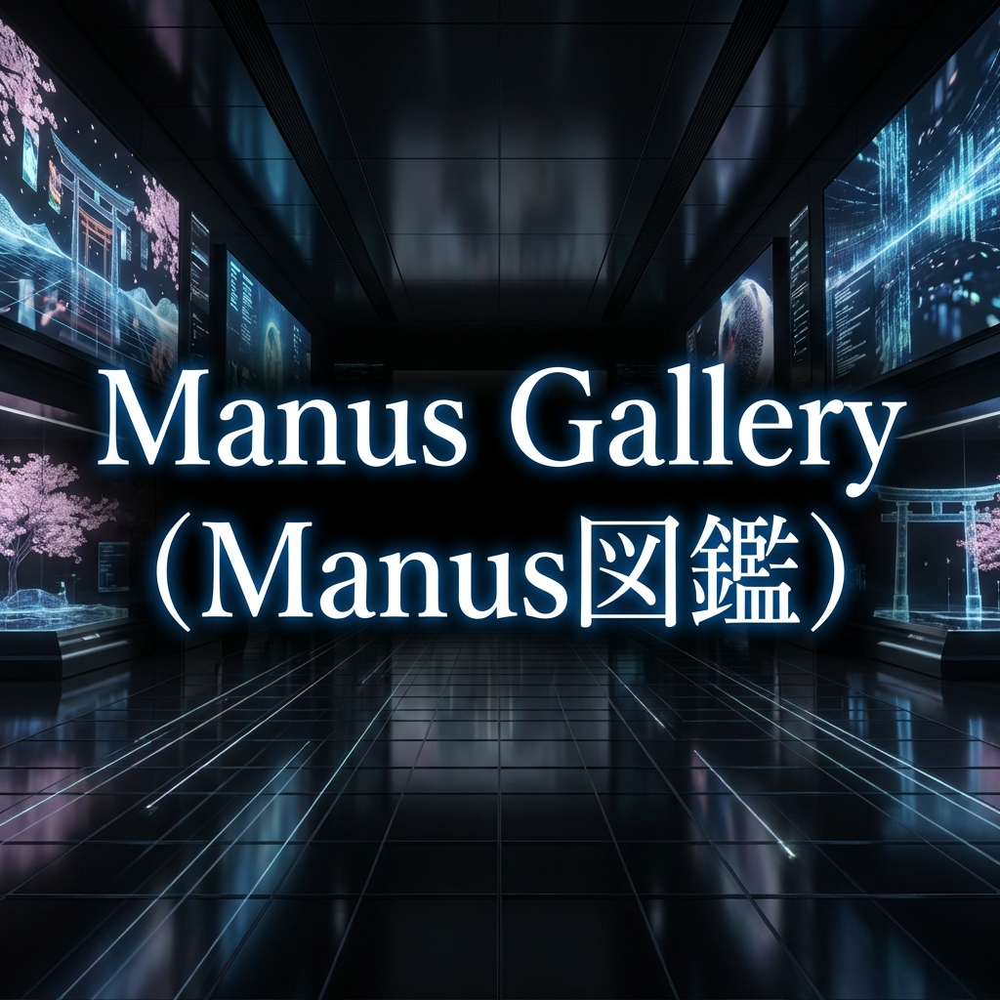

# Manus図鑑 (Manus Gallery)



**誰でも・いつでも・無料で見られるAI作品のオンラインギャラリー**


## 📖 プロジェクト概要

Manus図鑑は、AIによって作成されたツール、アート、ゲーム、ユーティリティなどの作品を展示するショーケースです。

- **目的**: 優れたAI作品を見つけやすくする
- **主な機能**: ギャラリー表示、カテゴリ検索、作品へのリンク
- **コンセプト**: 図鑑のように、見て楽しむ、探して楽しむ

## 🚀 開発環境のセットアップ

```bash
# 依存関係のインストール
npm install

# 開発サーバーの起動
npm run dev
```

<http://localhost:3000> にアクセスして確認できます。

## 📂 プロジェクト構造

- `src/app`: Next.js App Router
- `assets`: 画像などの静的リソース
- `.agent`: GA-Workspace (AI Agent Rules & Workflows)
- `docs`: 要件定義書などのドキュメント

## 📜 ドキュメント

- [要件定義 (Requirements)](docs/requirements.yml)
- [技術スタック (Stack)](.agent/rules/01-stack.md)

---

> [!NOTE]
> このリポジトリは **ZERO_GRAVITY** (GA-Workspace) によって管理されています。
> 🌸 Powered by 無重 星来 (SeiRa)
